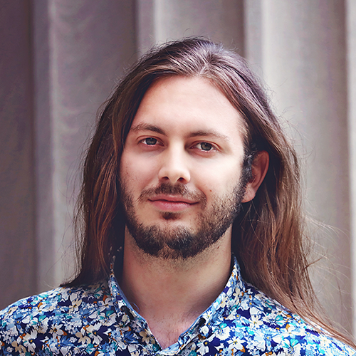

@def title = "Bio"

# Bio

@@row
I’m Jamison Sloan, a physicist interested in the interactions between light and matter. I'm currently an Intelligence Community (IC) Postdoctoral Fellow at the Ginzton Laboratory of Stanford University, working in the group of Jelena Vukčović. Prior to this, I completed my Ph.D. in the group of Marin Soljačić, where I was supported by the National Defense Science and Engineering Fellowship (NDSEG), as well as a Mathworks fellowship. I've also engaged in fruitful collaborations with other faculty, including John D. Joannopoulos (MIT) and Ido Kaminer (Technion).

<!-- a PhD student affiliated with the ~~~<a href=" http://www.rle.mit.edu/" target="_blank">Research Lab of Electronics (RLE)</a>~~~
at MIT. My research has been conducted in the ~~~<a href="https://www.rle.mit.edu/marin/" target="_blank">Photonics and Modern Electromagnetics group</a> ~~~of ~~~<a href="http://www.mit.edu/~soljacic/marin.html" target="_blank">Prof. Marin Soljačić</a>~~~, and has also been supported by collaborations with John D. Joannopoulos (MIT), and Ido Kaminer (Technion). I was previously supported by the National Defense Science and Engineering Fellowship (NDSEG), as well as a Mathworks fellowship. -->

@@profile-pic

@@

@@
